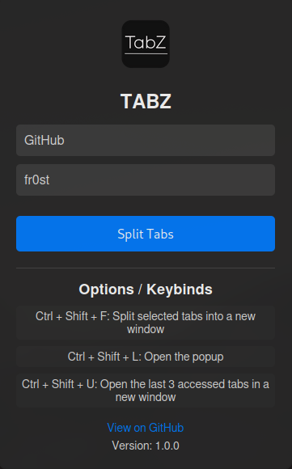

## A lightweight and user-friendly extension for splitting tabs

 

## Overview

**TabZ** is a simple and powerful browser extension that helps you manage your tabs. It lets you easily split selected tabs into a new window for better organization.

## Features

- **Split Tabs**: Easily select multiple tabs and separate them into a new window with just one click.
- **Keyboard Shortcuts**: Quickly utilize the extension’s features with customizable keyboard shortcuts.
- **User-Friendly Interface**: Enjoy a clean and intuitive design that simplifies tab management.

## Installation

| Browser                                | Download                                                                                                                                                                |
| -------------------------------------- | ----------------------------------------------------------------------------------------------------------------------------------------------------------------------- |
| Chromium-based (Chrome, Edge, Brave) |  |
| Firefox-based (Firefox, Floorp, Zen) |  |

## Usage

- Click on the TabZ icon in the browser toolbar to open the popup, or simply press **CTRL + SHIFT + L**.
- Select the tabs you wish to split by clicking on them.
- Click the **"Split Tabs"** button to transfer your selected tabs to a new window.
- You can also use keyboard shortcuts for quick access:
  - **Ctrl + Shift + F**: Split selected tabs into a new window (hold **CTRL** to select the tabs).
  - **Ctrl + Shift + L**: Open the TabZ popup.
  - **Ctrl + Shift + U**: Open the last 3 accessed tabs in a new window.

## Showcase

 <!-- Adjust width as needed -->

## License

This project is licensed under the MIT License. See the [LICENSE](LICENSE) file for more details.
